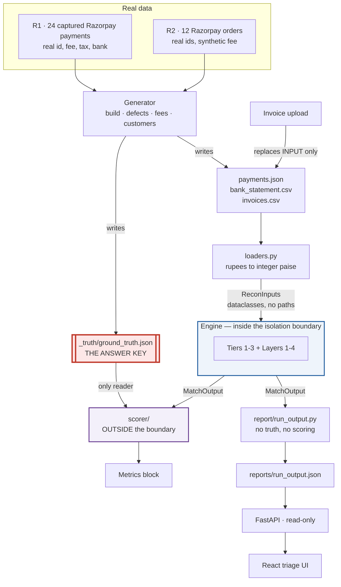
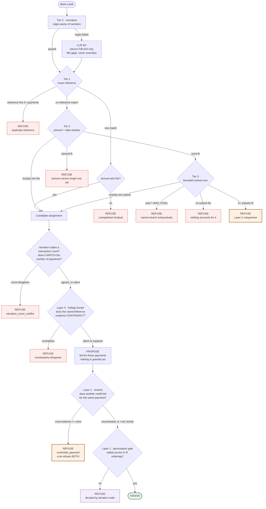
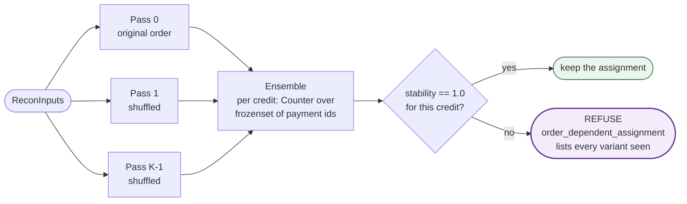
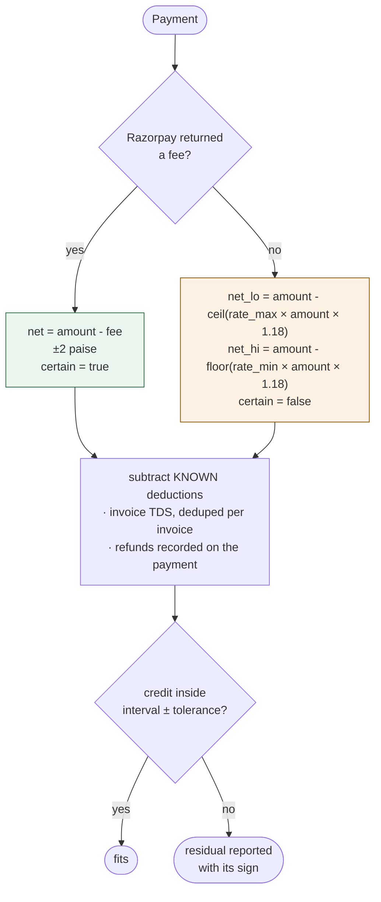
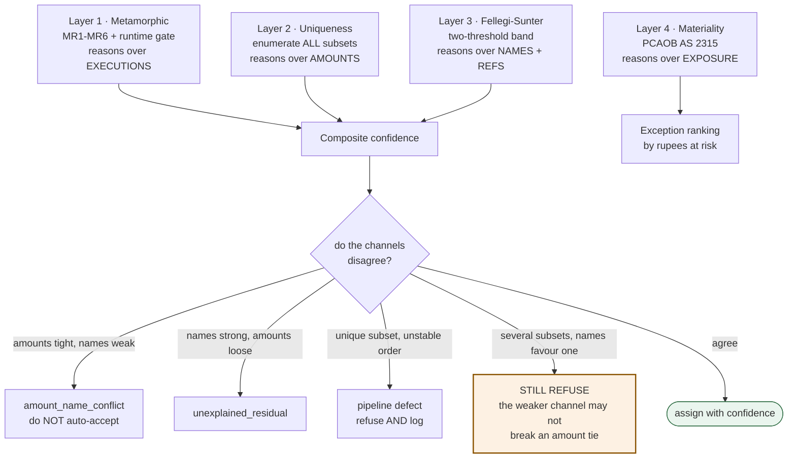
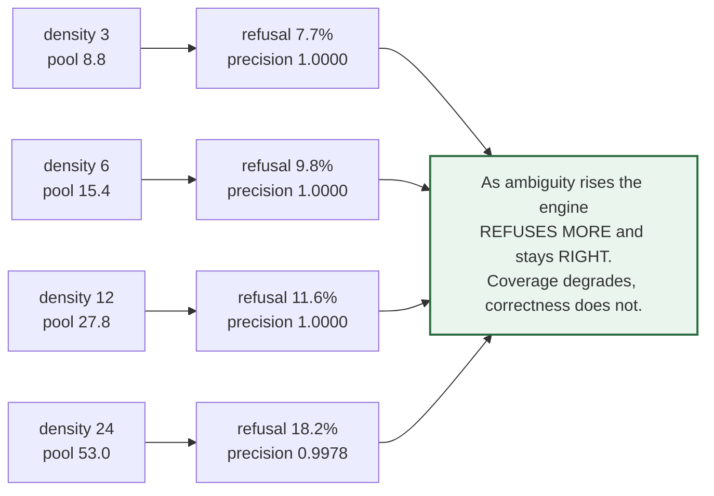
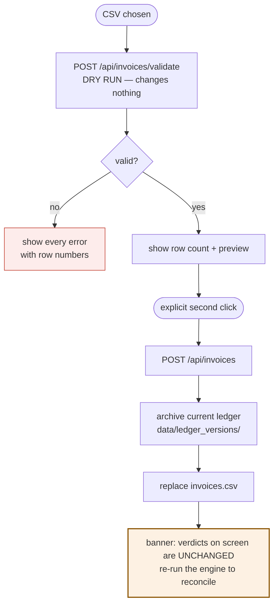

# Architecture flowcharts

Diagrams of how the system actually behaves, not how it was planned to. Where the two
differ, the difference is noted — several of these were redrawn after measurement
contradicted the original design.

---

## 1. End-to-end data flow, and where the trust boundary sits

The two red boundaries are the whole architecture. **Ground truth never crosses into the
engine**, and **the LLM never crosses into a verdict.**

**Why the arrow from `_truth` goes only to the scorer.** Enforced three ways: the
engine's input type carries no paths, an import-time audit hook raises if anything under
`recon.engine` opens that directory, and a test deletes the directory entirely and
asserts the engine produces byte-identical output.

---

## 2. The matching pipeline — descending order of evidence strength

Each tier either resolves, falls through, or **refuses**. A tier that finds ambiguity
stops: a weaker tier cannot resolve what a stronger one has shown to be underdetermined.

**Ten distinct ways to refuse and one way to assign.** That asymmetry is deliberate.
Every refusal names its cause, so an exception says which mechanism objected rather than
merely that something did.

Two of the ten were added after the diagram was first drawn, and both are worth calling
out because they are the only places the engine uses evidence that is not an amount:

- **`narration_count_conflict`.** A settlement narration states how many transactions it
  covers — `RAZORPAY SETTLEMENT setl_... 2 TXNS`. The engine had parsed that count since
  Block 3 and never consulted it, so a credit covering two payments could be posted to
  one whenever a netted refund happened to make the batch total equal a single payment's
  net. Tier 2 took the exact one-to-one fit and never reached tier 3, where enumeration
  would have found both decompositions and Layer 2 would have refused — the tier ordering
  short-circuited the uniqueness test. The count is admissible precisely because it is
  *independent of the amounts*: it can contradict an arithmetic fit without being derived
  from one.
- **`contested_payment`.** Claiming used to be greedy — credits were walked in sorted
  order and each took what it wanted, so two credits with equal claims on one payment
  were separated by the sort. The round is now propose-then-resolve, and equal evidence
  refuses **both**. A tie is not something to break; it is the same underdetermination
  Layer 2 already refuses on, reaching the engine through a different door.

---

## 3. Layer 1 — the permutation gate at runtime

MR1 is not only a test. It is the engine's primary execution path.

Two things this diagram had to be corrected for:

- **Absence counts against stability.** A credit assigned in 4 of 8 passes is *unstable*,
  not "perfectly stable across the passes where it appeared".
- **Every credit seen in ANY pass is gated**, not just those assigned in pass 0. Gating
  only pass 0's assignments silently exempted exactly the unstable ones — a credit
  assigned in 7 of 8 orderings and dropped in the 8th never reached the gate if the 8th
  happened to be pass 0.

The gate currently refuses nothing, and the reason has changed since this was written.
Three properties now make the matcher order-independent *by construction*: credits are
walked in a total, data-derived order; every tier refuses rather than chooses on ties;
and — new — claiming is no longer greedy. Each round proposes against a frozen `claimed`
set and then resolves contested payments on evidence, refusing when evidence ties, so no
credit's bid can shrink a later credit's pool.

That last one used to be the gap the gate existed to cover. Covering a design weakness
with a detector is weaker than not having it, so the gate is now a safety net rather than
load-bearing. Its zero is only meaningful because it is separately shown to fire against
a deliberately order-dependent matcher — see `tests/test_verification.py`.

---

## 4. How a payment's settled amount becomes an interval

The engine never knows a fee exactly unless Razorpay priced it, so every amount is a
range and every comparison is interval arithmetic.

**The engine deliberately does not share the generator's exact fee schedule.** If it did,
MR4 conservation would be tautological — the engine would reconcile because it was
inverting the very function that produced the data.

**Known deductions are subtracted, not searched for.** TDS is on the invoice and refunds
are on the payment, so both are facts before matching begins. Treating them as unknowns
would add a free variable per payment and make subset-sum combinatorially worse while
producing weaker answers.

---

## 5. The four verification layers, and where they can disagree

Conservation reasons over amounts; Fellegi-Sunter reasons over names and references.
They are independent channels that cannot fail the same way, which is the entire
justification for combining them — and why **amount is deliberately excluded from the FS
inputs.** Feeding it to both would make them correlated and the corroboration illusory.

**Measured caveat.** The composite confidence score is currently *decorative*: the
refusal layers strip essentially every error before scoring, so accepted assignments are
correct ~99% of the time regardless of their features and the score adds no measurable
information. See `METRICS.md`.

---

## 6. The density sweep — the claim that IS supported

Reproduce with `python run.py sweep`. This is the chart no vendor publishes, because
producing it requires reporting precision.

---

## 7. Invoice upload — the one write path

Three deliberate properties: validation is a **separate dry run** so nobody replaces a
ledger on one click; rejection is **wholesale**, because a partially applied ledger
reconciles against data nobody reviewed; and the success banner **refuses to imply the
reconciliation updated**, because it did not — the engine must be re-run.
